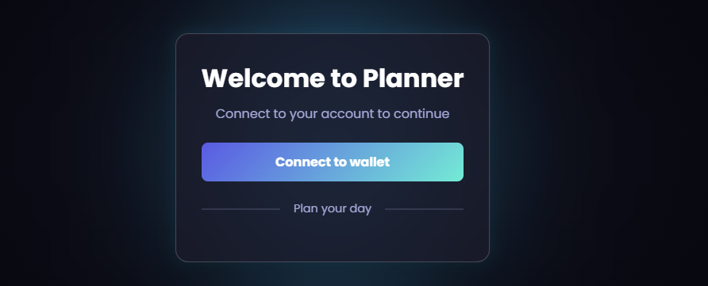

# Todo App with Chromia Blockchain Integration


video
[](https://www.youtube.com/watch?v=dmgQXFeejRk)

## Author Information
**Name**: Natnael Beshane  
**Email**: natnaelb8@gmail.com  

## Project Description
This Todo App allows users to manage tasks efficiently by adding, viewing, updating, deleting tasks, and sorting them by urgency. It integrates with the **Chromia Blockchain** using features such as **Chromia FT4** for account registration. The frontend is built using **React**, **TypeScript**, **Vite**, and **Postchain Client**, providing secure blockchain interactions.

### Key Features
- Add, view, update, and delete tasks.
- Tasks have descriptions, status (completed or not), and urgency levels.
- Filter tasks by status and sort them by due date.
- Integration with EVM wallets for account creation and session management.
- Data signing and secure interactions using blockchain technology.

## How It Works
1. **Chromia FT4**: Manages account registration and authentication with TTL login rules.
2. **Postchain Client**: Facilitates communication with the blockchain.
3. **React and TypeScript**: Handles the frontend interface for task management.
4. **EVM Wallet**: Creates a secure session allowing users to sign data and send it to the blockchain.

## Setup Instructions
### Prerequisites
- **Node.js**: Version 14 or higher
- **npm**: Installed globally
- **MetaMask**: Installed for wallet integration

### Installation Steps
1. Clone the repository:
   ```bash
   git clone https://github.com/Natnael-arch/todoapp_Chr.git
   cd todoapp_Chr
   ```
2. Install dependencies:
   ```bash
   npm install
   ```
3. Set up environment variables:
   Create a `.env` file in the root directory and add the following:
   ```env
   VITE_NODE_URL=http://localhost:7740
   VITE_BRID=<Your_BRID_for_the_Dapp>
   ```

   Replace `<Your_BRID_for_the_Dapp>` with the BRID of your running dapp.

4. Run the application:
   ```bash
   npm run dev
   ```
## Blockchain Setup
### Install Rell Dependencies
Use the `chromia.yml` file to install the necessary dependencies listed under the `libs` tag:
```bash
chr install
```

### Start the Local Test Node
Ensure your local test node is active by running:
```bash
chr node start
```

Access the dapp locally using the following parameters:
```bash
url=http://localhost:7740
brid_id=<generated after node starts>
```

### Optional: Reset the Database
If you want to start fresh, reset the database schema with:
```bash
chr node start --wipe
```


### Update the Local Test Node After Changes
If you modify the Rell code and need to apply changes to the running local test node, run:
```bash
chr node update
```

Ensure you use the same `chromia.yml` configuration and parameters as when the node was initially started.

## Usage Instructions
1. Connect your EVM wallet (e.g., MetaMask) to the application.
2. Add a new task by providing a name, description, due date, and urgency level.
3. View tasks in the list, filtered by status or sorted by due date.
4. Update or delete tasks as needed.
5. Manage tasks securely with blockchain-backed authentication.

## Additional Information
This app demonstrates the integration of Chromia blockchain features with a modern web frontend. It showcases secure session management, blockchain-based data signing, and real-time task updates.
